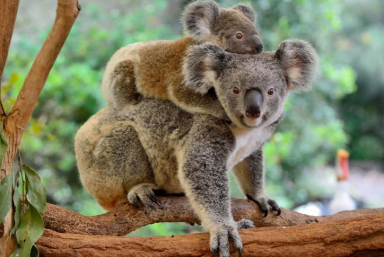

```{r setup, include=FALSE}
knitr::opts_chunk$set(echo = FALSE)
```

## Details

* **Source of the article**
<https://phys.org/news/2019-08-poo-transplants-koalas.html>

* **Words number**
411




## Vocabulary

| Words from the text | Synonym/explanation in English |
| ------------------- | ------------------------------ |
| Drop | Let or make (the population) fall vertically. |
| Led to ( to lead ) | Culminate or result in (a particular event or consequence) |
| To feed on | To eat (something particular) |
| To wonder | Desire to know something; feel curious. |
| The microbiome | The total number, population of the Koala’s gut’s bacterias. |
| Expand their diet | Make their type of food larger or more extensive. |
| Monitored ( to monitor ) | Observe and check the progress or quality of (something) over a period of time; keep under systematic review. |
| Assessed ( to assess ) | Evaluate or estimate the nature, ability, or quality of something |
| Abundant | Existing or available in large quantities; plentiful. |


## Analysis table

|                              |                                                                     |
| ---------------------------- | ------------------------------------------------------------------- |
| Researchers                  | University of Queensland researchers, UQ School of Chemistry and Molecular Biosciences Dr. Michaela Blyton, Dr. Ben Moore.                        |
| Published in?                | 21 August 2019                                                       |
| General topic?               |  This article explains the procedure to make the koalas eat a wider range of food, and how it is done with a scientific method: The fecal transplants to change the microbiome of the koalas' gut.                      |
| Procedure/what was examined? | The method is called " fecal transplants ". They collected poo from radio-collared wild koalas that ate messmate, and concentrated the microorganisms in the poo. Then, they packaged it into acid-resistant capsules and gave them to the captive koalas. The procedure had to show if the captive koalas could now eat another variety of trees. |
| Conclusions/discovery?       | Finally, the koalas' microbiomes changed, allowing them to eat antother variety of Eucalyptus, the messmate.      |
| Remaining questions?         | These transplants could affect all aspects of the koalas' ecology including nutrition, habitat selection and resource use. These questions will be resolved in the future, when all the effects of the transplants will be detected. |
